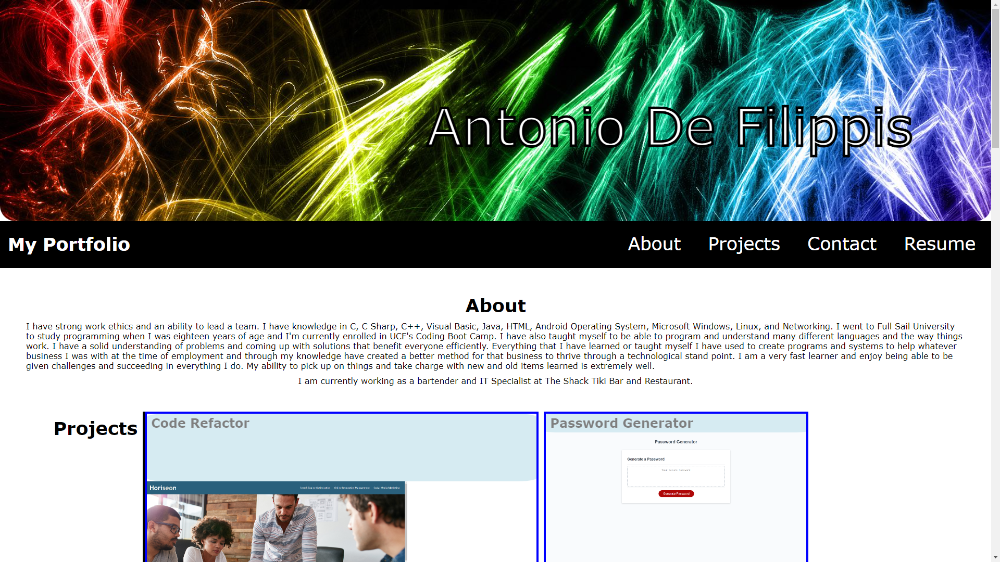

# MyProfessionalPortfolio

  ## License: MIT License 
  ###  https://choosealicense.com/licenses/mit/

  ## Description
  A professional profile showcasing advanced css styling

  ## Table of Contents 
  - [Installation](#installation)
  - [Usage](#usage)
  - [Contribution](#contributing)
  - [Testing](#tests)
  - [License](#license)
  - [Images](#images)
  - [Walkthrough](#walkthrough)
  - [Questions?](#questions)
    
  ## Installation:
  None

  ## Usage:
  None

  ## License:
  MIT License

  ## Contributing:
  You can visit my github and clone the repository code

  ## Tests:
  None
  
  ## Images:
  

  ## Walkthrough:
  None

  ## Questions?:
  - Github: [Quaz711](https://github.com/Quaz711)
  - Deployed: [MyPortfolio](https://quaz711.github.io/MyProfessionalPortfolio/)
  - Email: Quaz711@hotmail.com
  - Additional: You can contact me through my email or send a request on github